# MobileTechChallenge
Android app for displaying movies using OMDb Api https://www.omdbapi.com/

Getting Started
---------------
This project uses the Gradle build system. To build this project, use the
`gradlew build` command or use "Import Project" in Android Studio.

Supported platform :
Android Phones Marshmallow (6.0) and above

Permissions : 
WRITE_EXTERNAL_STORAGE

INTERNET

ACCESS_NETWORK_STATE

ACCESS_WIFI_STATE

READ_EXTERNAL_STORAGE

Current Version :
1.0

Libraries Used
--------------
* [Foundation][0] - Components for core system capabilities, Kotlin extensions and support for
  multidex and automated testing.
  * [AppCompat][1] - Degrade gracefully on older versions of Android.
  * [Android KTX][2] - Write more concise, idiomatic Kotlin code.
  * [Test][3] - An Android testing framework for unit and runtime UI tests.
* [Architecture][4] - A collection of libraries that help you design robust, testable, and
  maintainable apps. Start with classes for managing your UI component lifecycle and handling data
  persistence.
  * [Lifecycles][5] - Create a UI that automatically responds to lifecycle events.
  * [LiveData][6] - Build data objects that notify views when the underlying database changes.
  * [Room][7] - Access your app's SQLite database with in-app objects and compile-time checks.
  * [ViewModel][8] - Store UI-related data that isn't destroyed on app rotations. Easily schedule
     asynchronous tasks for optimal execution.
* [UI][9] - Details on why and how to use UI Components in your apps - together or separate
  * [Animations & Transitions][10] - Move widgets and transition between screens.
  * [MotionLayout][11] - Move widgets and transition between screens.
  * [Fragment][12] - A basic unit of composable UI.
  * [Layout][13] - Lay out widgets using different algorithms.
* Third party
  * [Coil][14] for image loading
  * [Koin][15] A pragmatic lightweight dependency injection framework for Kotlin developers
  * [Kotlin Coroutines][16] for managing background threads with simplified code and reducing needs for callbacks
  * [Retrofit][17] A pragmatic lightweight dependency injection framework for Kotlin developers
  * [Lottie][18] Lottie is a mobile library for Android and iOS that parses Adobe After Effects animations exported as json with Bodymovin and renders them natively on mobile!

Design Patterns used
-------

The Repository pattern - used to decouple the business logic and the data access layers in your application
Repository pattern is used in abstracting the saving of movie list and searches to database.

Builder pattern - used to separate the construction of a complex object from its representation.
Builder pattern is used in accessing the webservice for omdb api since the webservice utilizes okhttp configuration.

Observer pattern -The observer pattern is a software design pattern in which an object, called the subject, maintains a list of its dependents, called observers, and notifies them automatically of any state changes, usually by calling one of their methods.
Observer pattern is used in notifying whether the movie results already exist. if it exist it will display the list of movies

[0]: https://developer.android.com/jetpack/components
[1]: https://developer.android.com/topic/libraries/support-library/packages#v7-appcompat
[2]: https://developer.android.com/kotlin/ktx
[3]: https://developer.android.com/training/testing/
[4]: https://developer.android.com/jetpack/arch/
[5]: https://developer.android.com/topic/libraries/architecture/lifecycle
[6]: https://developer.android.com/topic/libraries/architecture/livedata
[7]: https://developer.android.com/topic/libraries/architecture/room
[8]: https://developer.android.com/topic/libraries/architecture/viewmodel
[9]: https://developer.android.com/guide/topics/ui
[10]: https://developer.android.com/training/animation/
[11]: https://developer.android.com/training/constraint-layout/motionlayout
[12]: https://developer.android.com/guide/components/fragments
[13]: https://developer.android.com/guide/topics/ui/declaring-layout
[14]: https://github.com/coil-kt/coil
[15]: https://insert-koin.io/
[16]: https://kotlinlang.org/docs/reference/coroutines-overview.html
[17]: https://square.github.io/retrofit/
[18]: https://github.com/airbnb/lottie-android

Running the app : https://developer.android.com/training/basics/firstapp/running-app

How to run the application using a real device
=================

Set up your device as follows: 

Connect your device to your development machine with a USB cable. If you developed on Windows, you might need to install the appropriate USB driver for your device.
Perform the following steps to enable USB debugging in the Developer options window:
Open the Settings app.
If your device uses Android v8.0 or higher, select System. Otherwise, proceed to the next step.
Scroll to the bottom and select About phone.
Scroll to the bottom and tap Build number seven times.
Return to the previous screen, scroll to the bottom, and tap Developer options.
In the Developer options window, scroll down to find and enable USB debugging.
Run the app on your device as follows:

In Android Studio, select your app from the run/debug configurations drop-down menu in the toolbar.
In the toolbar, select the device that you want to run your app on from the target device drop-down menu.

Figure 1. Target device drop-down menu

Click Run .

Android Studio installs your app on your connected device and starts it.

How to run on an emulator
=================

Run the app on an emulator as follows:

In Android Studio, create an Android Virtual Device (AVD) that the emulator can use to install and run your app.
In the toolbar, select your app from the run/debug configurations drop-down menu.
From the target device drop-down menu, select the AVD that you want to run your app on.

Figure 2. Target device drop-down menu

Click Run .

Android Studio installs the app on the AVD and starts the emulator. 

How to build the documentation (dokka)
=================

https://github.com/Kotlin/dokka

Build the documentation as follows:

In Android Studio, Choose the class/interface to update the documentation for. 
In the active file(class or interface), Update the documentation for its classes, parameters and functions.
Do this for all files. Once done make sure to apply the dokka plugin

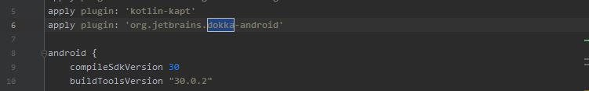

Figure 3. Dokka plugin

then make sure to indicate where to indicate what output will the documentation be and where
the documentation will be saved.

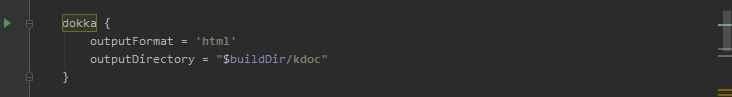

Figure 4. Dokka directory

Sync gradle after. then build the documentation by choosing Gradle side tab and navigating to app/documentation/dokka and
right click on dokka and then click Run. 

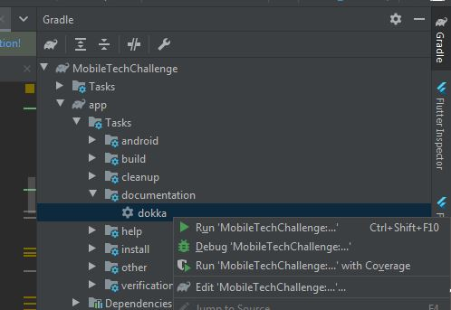

Figure 5. Dokka build

It will generate the documentation after

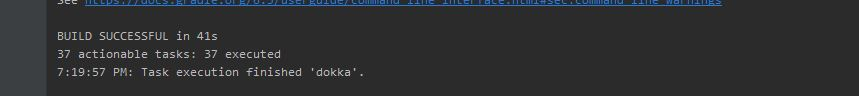

Figure 6. Dokka finished

Current documentation can be found here : https://github.com/cominteract/MobileTechChallenge/tree/main/kdoc

How to run unit tests
=================

https://developer.android.com/training/testing/unit-testing/local-unit-tests

Run the unit test as follows:

On Android Studio, Make sure that these are added to gradle

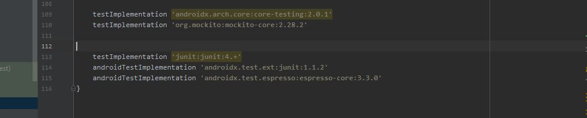

Figure 7. Gradle requirements for unit tests

Create unit test file and update the unit tests as needed on the use cases for the app
On our case we just want to know whether the results are being populated and whether the 
details for a particular movie result is updated with accurate info as well

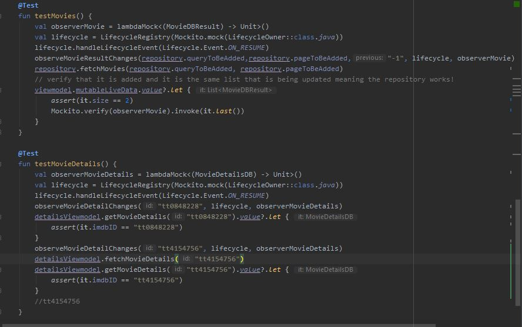

Figure 8. Unit test code

Once that is finished, While still on the unit test file (MovieUnitTest.kt), On the bar at the left side of the code window 
Click Run and it will run the unit test for the particular file

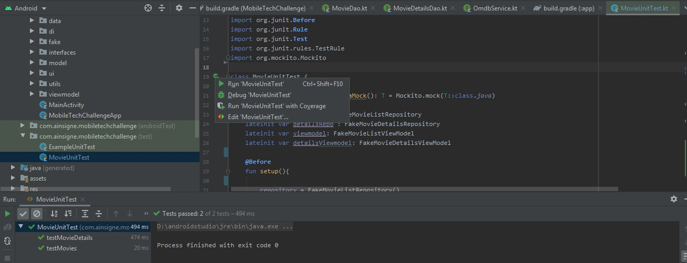

Figure 9. Unit test running

How to build apk
=================

On Android Studio Menu, Click Build -> Build Bundle(s)/Apk(s) -> Build APK(s)

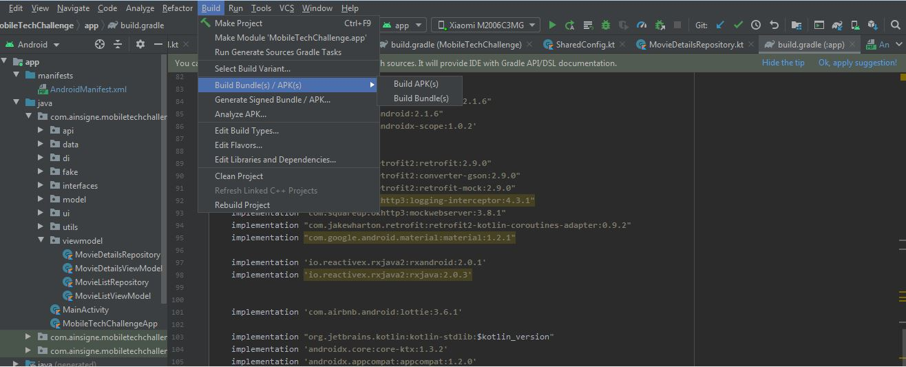

Figure 10. Generate a debug apk

Screenshots
-----------

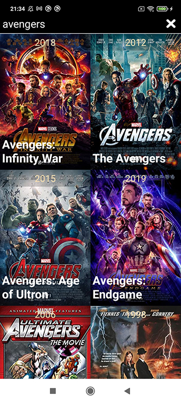

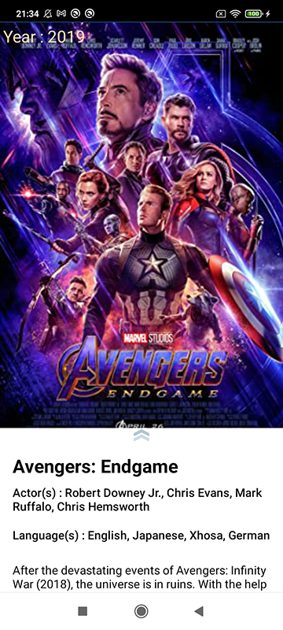

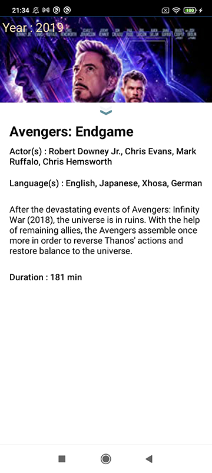

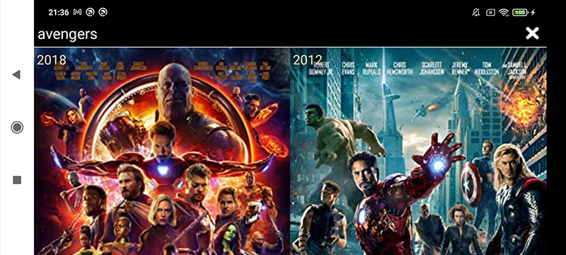

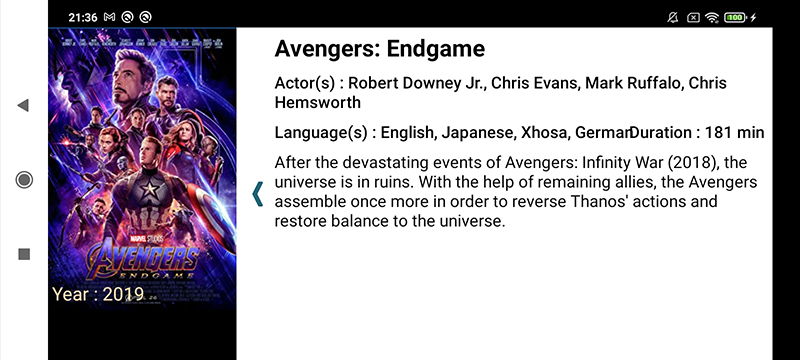

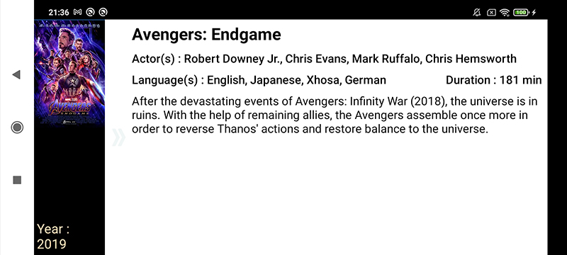
